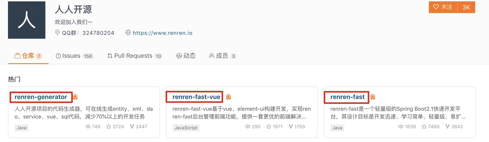
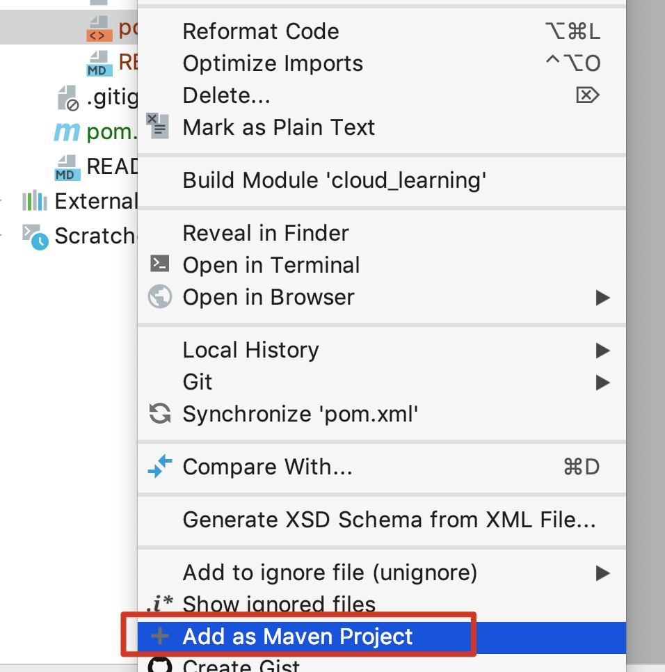
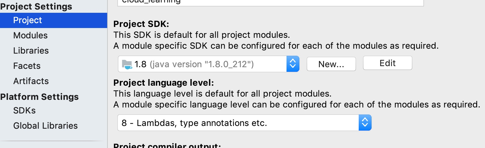
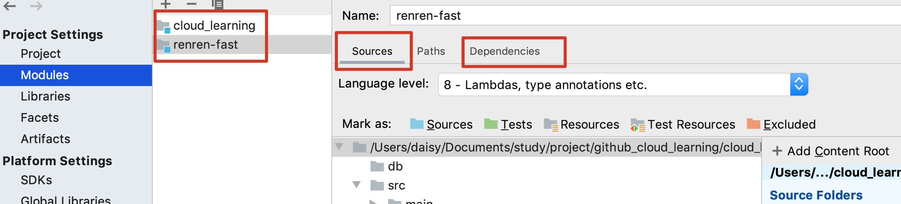
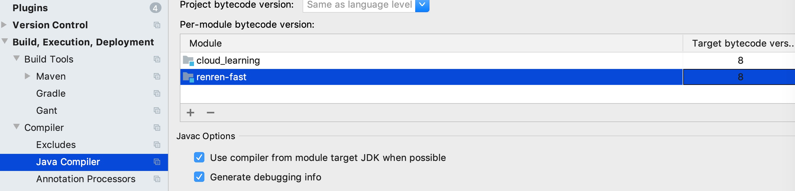
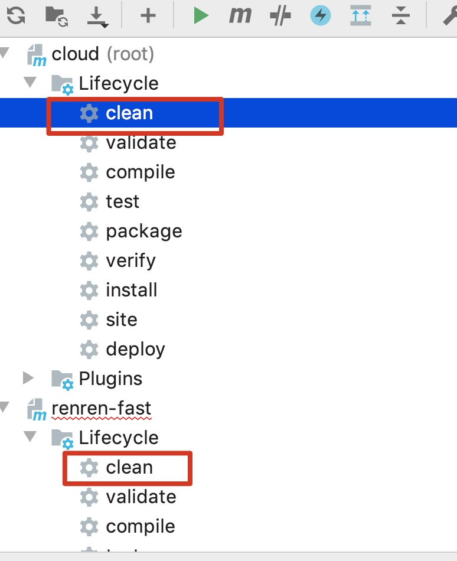

# 基础框架搭建

## centos环境部署

- 时间同步

  ```
  安装ntpdate工具yum -y install ntp ntpdate
  设置系统时间与网络时间同步ntpdate cn.pool.ntp.org
  将系统时间写入硬件时间hwclock --systohc
  ```

- docker安装

  ```shell
  # 安装一些必要的系统工具：
  yum -y install yum-utils device-mapper-persistent-data lvm2
  # 添加软件源信息：
  yum-config-manager --add-repo http://mirrors.aliyun.com/docker-ce/linux/centos/docker-ce.repo
  # 更新 yum 缓存：
  yum makecache fast
  # 安装 Docker-ce：
  yum -y install docker-ce
  # 启动 Docker 后台服务：
  systemctl start docker
  ```

  - docker-compose安装

    ```
    curl -L https://get.daocloud.io/docker/compose/releases/download/1.24.0/docker-compose-`uname -s`-`uname -m` > /usr/local/bin/docker-compose
    # 赋权
    chmod +x /usr/local/bin/docker-compose
    # 验证安装成功
    docker-compose --version
    # 下载地址：https://github.com/docker/compose/releases?after=1.27.0-rc3
    
    # 或者 下载地址：https://github.com/docker/compose/releases?after=1.27.0-rc3
    ```

    

  - mysql安装

    ```
    docker pull mysql:5.7
    
    docker run -p 3306:3306 --name mysql \
    -v /mydata/mysql/log:/var/log/mysql \
    -v /mydata/mysql/data:/var/lib/mysql \
    -v /mydata/mysql/conf:/etc/mysql \
    -e MYSQL_ROOT_PASSWORD=root  \
    -d mysql:5.7
    
    docker exec -it mysql /bin/bash
    mysql -uroot -proot --default-character-set=utf8
    grant all privileges on *.* to 'reader' @'%' identified by 'root';
    flush privileges;
    exit
    exit
    
    docker cp /usr/share/zoneinfo/Asia/Shanghai mysql:/etc/localtime
    docker restart mysql
    docker container update --restart=always mysql
    ```

  - nacos安装

    ```
    git clone https://github.com/nacos-group/nacos-docker.git
    cd nacos-docker
    mkdir -p /mydata/nacos
    
    vim example/standalone-derby.yaml 修改如下内容：
    	- ./standalone-logs/:/mydata/nacos/logs
    	- ./init.d/custom.properties:/mydata/nacos/init.d/custom.properties
    docker-compose -f example/standalone-derby.yaml up -d
    ```

    

## 人人开源项目下载

- 项目地址：https://gitee.com/renrenio

  

## 文件拷贝

- 下载的renren-fast解压文件夹拷贝到项目中

- 根目录创建总pom文件

  ```xml
  <?xml version="1.0" encoding="UTF-8"?>
  <project xmlns="http://maven.apache.org/POM/4.0.0" xmlns:xsi="http://www.w3.org/2001/XMLSchema-instance"
  	xsi:schemaLocation="http://maven.apache.org/POM/4.0.0 http://maven.apache.org/xsd/maven-4.0.0.xsd">
  	<modelVersion>4.0.0</modelVersion>
  	<groupId>com.taiwarm.cloud</groupId>
  	<artifactId>cloud</artifactId>
  	<version>1.0</version>
  	<packaging>pom</packaging>
  	<description>root pom</description>
  
      <modules>
          <module>renren-fast</module>
      </modules>
  
  </project>
  
  ```

  

- 设置pom、renren-fast为maven项目

  - pom文件鼠标右键设置为maven项目

    

- 设置编译环境

  

  

  

- 编译

  

## 项目启动

- 拷贝renren-fast下mysql数据库作为初始数据库

- 添加数据库名字

  ```
  DROP DATABASE IF EXISTS `cloud_admin`;
  CREATE DATABASE cloud_admin CHARACTER SET utf8mb4 COLLATE utf8mb4_general_ci;
  USE cloud_admin;
  ```

- 启动后端renren-fast项目

- 启动前端renren-fast-vue项目

  ```
  cnpm install
  npm run dev
  ```

- 登录：admin/admin

## 模块规划

| 模块名字 | 端口号 | 功能 |
| -------- | ------ | ---- |
| gateway  | 8888   |      |
| member   | 8001   |      |
| question | 8000   |      |
| study    | 8002   |      |
| search   | 8003   |      |

