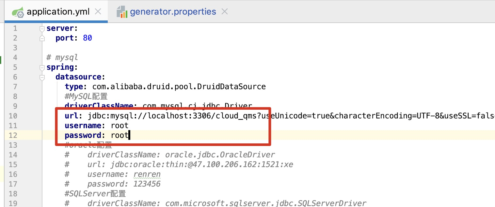
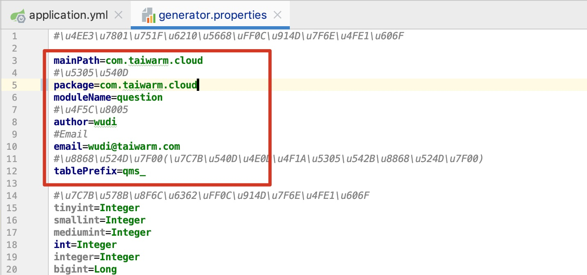
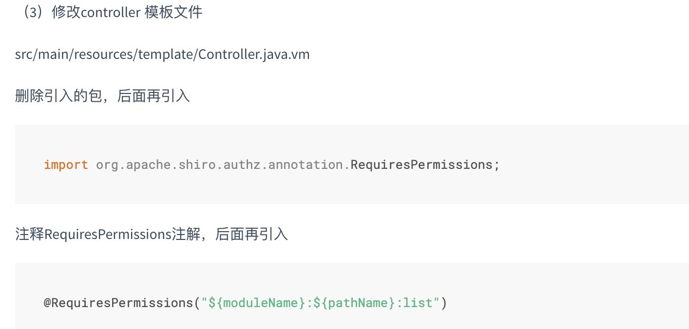
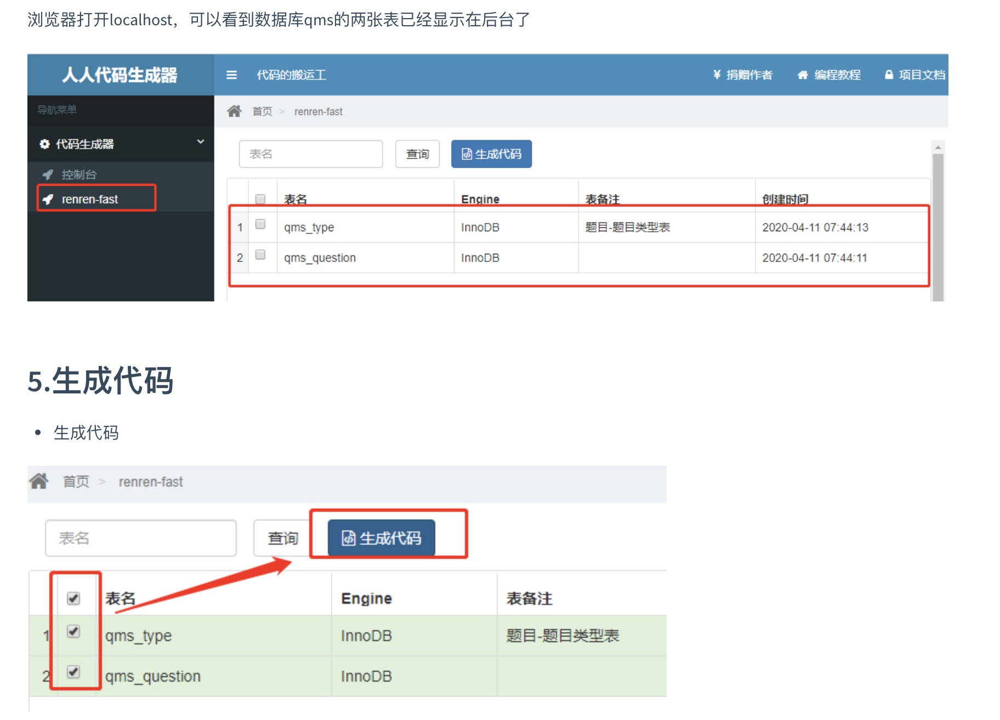
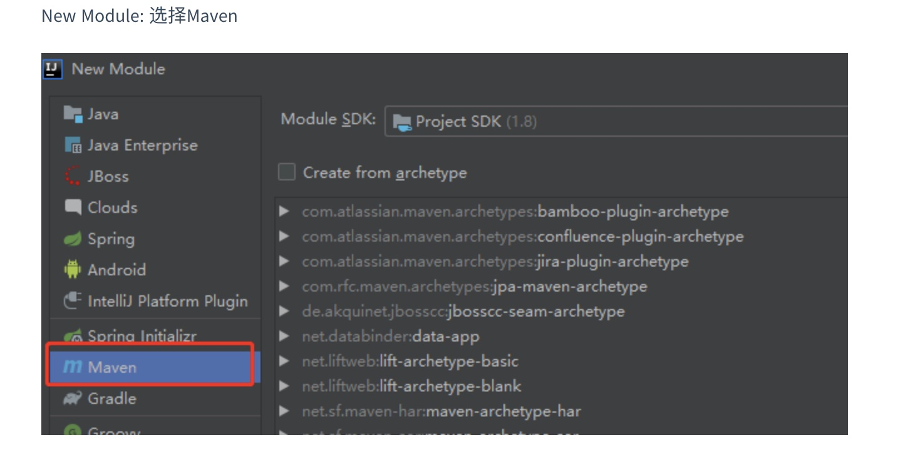
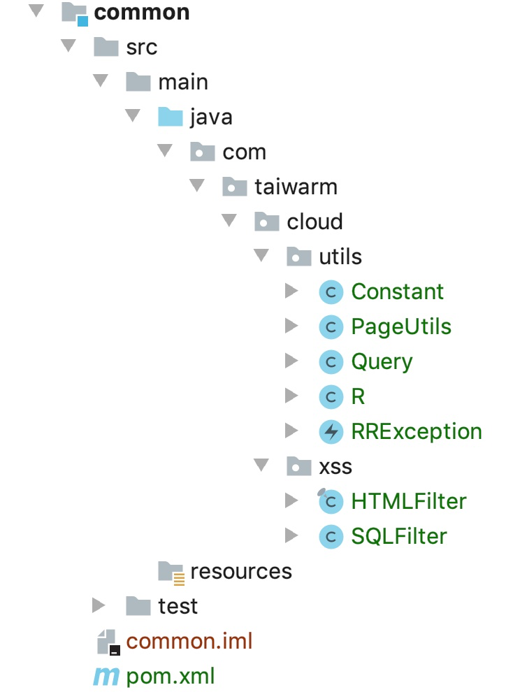
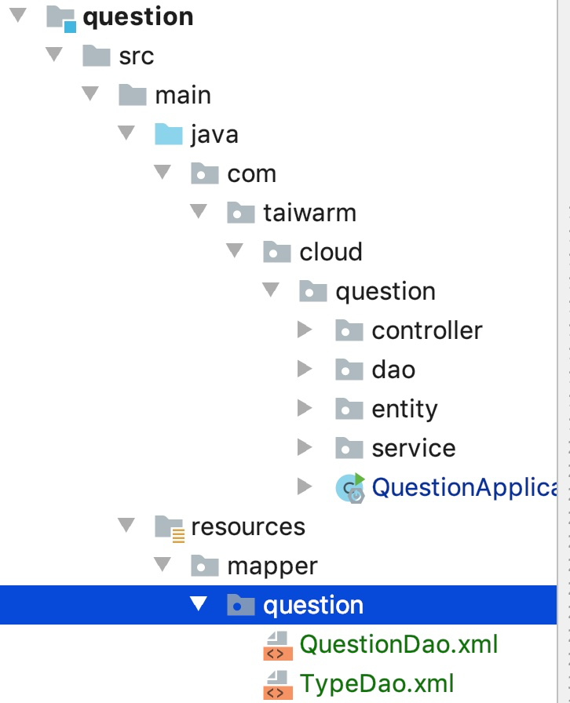

# 代码自动生成

## 引入项目

- 下载[renren-generator](https://gitee.com/renrenio/renren-generator) 项目
- 拷贝到项目中
- pom文件加入maven项目
- 修改编译环境
- 总pom文件加入module
- 导入依赖包

## 配置项目

### 修改数据库



### 修改包名



### 修改配置文件



## 启动服务、生成代码



## 创建common模块

### 创建



### 目录结构

- 文件从renren-fast中拷贝

  

### pom

```xml
<?xml version="1.0" encoding="UTF-8"?>
<project xmlns="http://maven.apache.org/POM/4.0.0"
         xmlns:xsi="http://www.w3.org/2001/XMLSchema-instance"
         xsi:schemaLocation="http://maven.apache.org/POM/4.0.0 http://maven.apache.org/xsd/maven-4.0.0.xsd">
    <parent>
        <artifactId>cloud</artifactId>
        <groupId>com.taiwarm.cloud</groupId>
        <version>1.0</version>
    </parent>
    <modelVersion>4.0.0</modelVersion>

    <groupId>com.taiwarm.cloud</groupId>
    <artifactId>common</artifactId>

    <dependencies>
        <!--mybatis-plus DAO层工具 https://mp.baomidou.com/-->
        <dependency>
            <groupId>com.baomidou</groupId>
            <artifactId>mybatis-plus</artifactId>
            <version>3.2.0</version>
        </dependency>
        <!--lombok 不需要写getter,setter方法了-->
        <dependency>
            <groupId>org.projectlombok</groupId>
            <artifactId>lombok</artifactId>
            <version>1.18.12</version>
        </dependency>
        <!--httpcore 依赖-->
        <dependency>
            <groupId>org.apache.httpcomponents</groupId>
            <artifactId>httpcore</artifactId>
            <version>4.4.12</version>
        </dependency>
        <!--commons-lang 依赖 -->
        <dependency>
            <groupId>commons-lang</groupId>
            <artifactId>commons-lang</artifactId>
            <version>2.6</version>
        </dependency>
        <!--  导入servlet-api 依赖  -->
        <dependency>
            <groupId>javax.servlet</groupId>
            <artifactId>servlet-api</artifactId>
            <version>2.5</version>
            <scope>provided</scope>
        </dependency>
        <dependency>
            <groupId>com.baomidou</groupId>
            <artifactId>mybatis-plus-boot-starter</artifactId>
            <version>3.2.0</version>
        </dependency>
        <!--添加mysql驱动-->
        <dependency>
            <groupId>mysql</groupId>
            <artifactId>mysql-connector-java</artifactId>
            <version>8.0.17</version>
        </dependency>

    </dependencies>

    <build>
        <plugins>
            <plugin>
                <groupId>org.apache.maven.plugins</groupId>
                <artifactId>maven-compiler-plugin</artifactId>
                <version>3.6.1</version>
                <configuration>
                    <source>1.8</source>
                    <target>1.8</target>
                    <encoding>UTF-8</encoding>
                </configuration>
            </plugin>
        </plugins>
    </build>


</project>

```

## 拷贝代码到question项目

### 目录结构



### application.yml

```yaml
spring:
  datasource:
    driver-class-name: com.mysql.cj.jdbc.Driver
    url: jdbc:mysql://127.0.0.1:3306/cloud_qms?useUnicode=true&characterEncoding=UTF-8&serverTimezone=Asia/Shanghai
    username: root
    password: root
mybatis-plus:
  mapper-locations: classpath:/mapper/**/*.xml
  global-config:
    db-config:
      id-type: auto
server:
  port: 8000

```

### pom

```xml
<?xml version="1.0" encoding="UTF-8"?>
<project xmlns="http://maven.apache.org/POM/4.0.0" xmlns:xsi="http://www.w3.org/2001/XMLSchema-instance"
	xsi:schemaLocation="http://maven.apache.org/POM/4.0.0 https://maven.apache.org/xsd/maven-4.0.0.xsd">
	<modelVersion>4.0.0</modelVersion>
	<parent>
		<groupId>org.springframework.boot</groupId>
		<artifactId>spring-boot-starter-parent</artifactId>
		<version>2.5.2</version>
		<relativePath/> <!-- lookup parent from repository -->
	</parent>
	<groupId>com.taiwarm.cloud</groupId>
	<artifactId>question</artifactId>
	<version>1.0</version>
	<name>question</name>
	<description>question module</description>
	<properties>
		<java.version>1.8</java.version>
		<spring-cloud.version>2020.0.3</spring-cloud.version>
	</properties>
	<dependencies>
		<dependency>
			<groupId>org.springframework.boot</groupId>
			<artifactId>spring-boot-starter-web</artifactId>
		</dependency>
		<dependency>
			<groupId>org.springframework.cloud</groupId>
			<artifactId>spring-cloud-starter-openfeign</artifactId>
		</dependency>

		<dependency>
			<groupId>org.springframework.boot</groupId>
			<artifactId>spring-boot-starter-test</artifactId>
			<scope>test</scope>
		</dependency>

        <dependency>
            <groupId>com.taiwarm.cloud</groupId>
            <artifactId>common</artifactId>
            <version>1.0</version>
        </dependency>
	</dependencies>
	<dependencyManagement>
		<dependencies>
			<dependency>
				<groupId>org.springframework.cloud</groupId>
				<artifactId>spring-cloud-dependencies</artifactId>
				<version>${spring-cloud.version}</version>
				<type>pom</type>
				<scope>import</scope>
			</dependency>
		</dependencies>
	</dependencyManagement>

	<build>
		<plugins>
			<plugin>
				<groupId>org.springframework.boot</groupId>
				<artifactId>spring-boot-maven-plugin</artifactId>
			</plugin>
		</plugins>
	</build>

</project>

```

