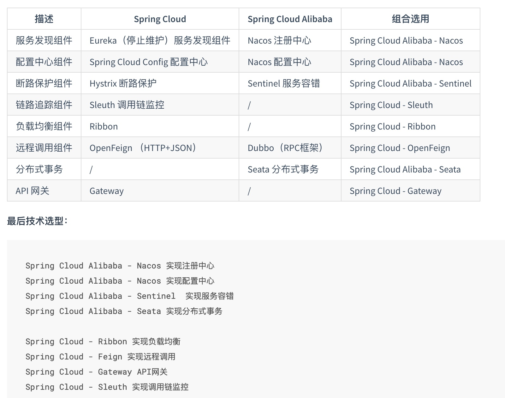
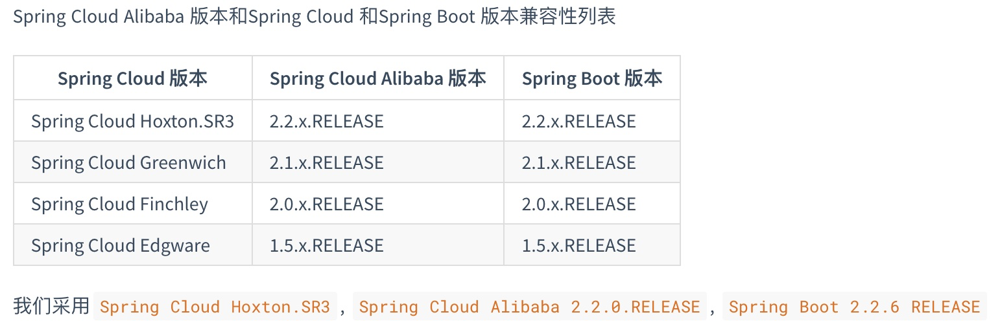

# Spring Cloud Alibaba

## 架构选型

参考：[alibaba 说明](https://github.com/alibaba/spring-cloud-alibaba/wiki/%E7%89%88%E6%9C%AC%E8%AF%B4%E6%98%8E)



## 版本选型



## pom引入

- common模块

  ```xml
  <dependencyManagement>
    <dependencies>
      <!--  Spring Cloud Alibaba 依赖  -->
      <dependency>
        <groupId>com.alibaba.cloud</groupId>
        <artifactId>spring-cloud-alibaba-dependencies</artifactId>
        <version>2.2.0.RELEASE</version>
        <type>pom</type>
        <scope>import</scope>
      </dependency>
    </dependencies>
  </dependencyManagement>
  ```

  