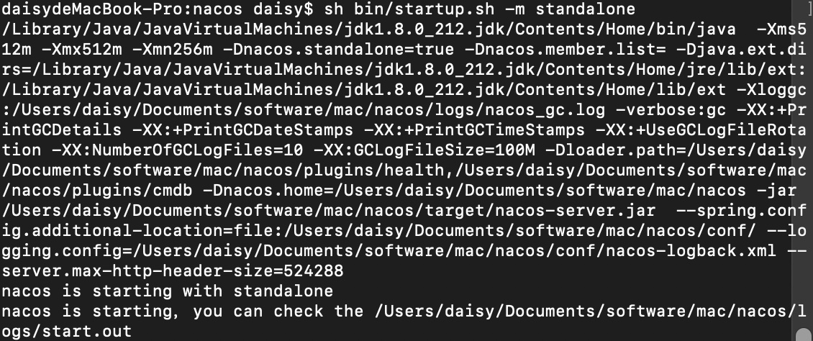
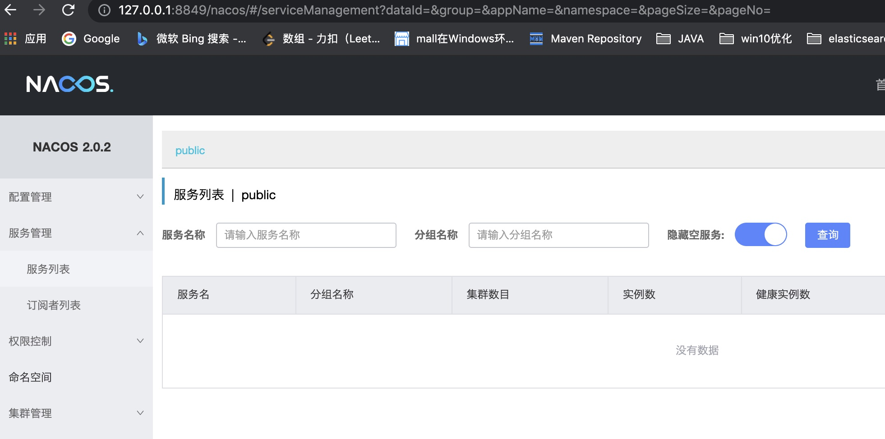

# Nacos注册中心

## 服务启动

```
sh bin/startup.sh -m standalone
```



## 服务访问

- 用户名、密码：nacos/nacos

  

## pom引入

- common模块

  ```xml
  <!-- nacos discovery 服务发现组件-->
  <dependency>
      <groupId>com.alibaba.cloud</groupId>
      <artifactId>spring-cloud-starter-alibaba-nacos-discovery</artifactId>
  </dependency>
  ```

## 模块配置

### application.yml

- nacos地址

  ```yaml
  spring:
     cloud:
      nacos:
        discovery:
          server-addr: 127.0.0.1:8849
  ```

- 服务名称

  ```yaml
  spring:
    application:
      name: question
  ```

  

### Application

- 为每个服务启动类增加注解

  ```
  @EnableDiscoveryClient
  ```

  