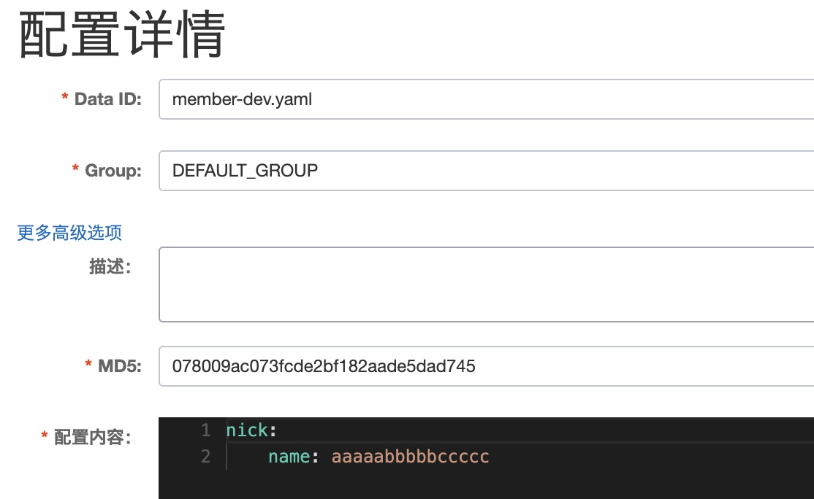

# Nacos配置中心

## 单文件配置

### 配置内容

#### bootstrap.yml

- 必须使用bootstrap.yml原因是：bootstrap.yml配置的内容优先级比application.yml高，否则配置nacos的配置中心端口8849不会生效

  

  ```yaml
  spring:
    cloud:
      nacos:
        config:
          server-addr: 127.0.0.1:8849
          file-extension: yaml
    profiles:
      active: dev
    application:
      name: member
  ```

#### 获取内容

- 在每个需要动态刷新的类上都需要增加@RefreshScope，没有全局的

  

#### 配置管理

- Data Id名字规则：spring.application.name-spring.profiles.active.file-extension

  



## 多命名空间配置

### application.yml

- 内容可以全部删除

  

### bootstrap.yml

- 多环境配置、唯一主配置文件

  ```yaml
  spring:
    cloud:
      nacos:
        config:
          namespace: member
          group: dev
          server-addr: 127.0.0.1:8849
          file-extension: yaml
          extension-configs[0]:
            data-id: datasource.yml
            group: ${spring.cloud.nacos.config.group}
            refresh: true
          extension-configs[1]:
            data-id: mybatis.yml
            group: ${spring.cloud.nacos.config.group}
            refresh: true
        discovery:
          server-addr: 127.0.0.1:8849
    application:
      name: member
  ```

### 获取内容

- 同上

## nacos配置

- 创建命名空间

  

- 配置列表

  

