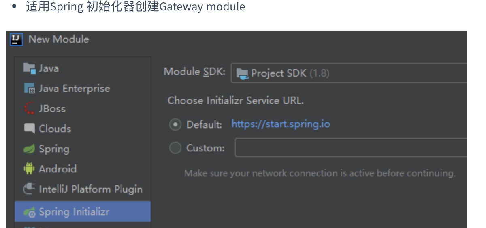
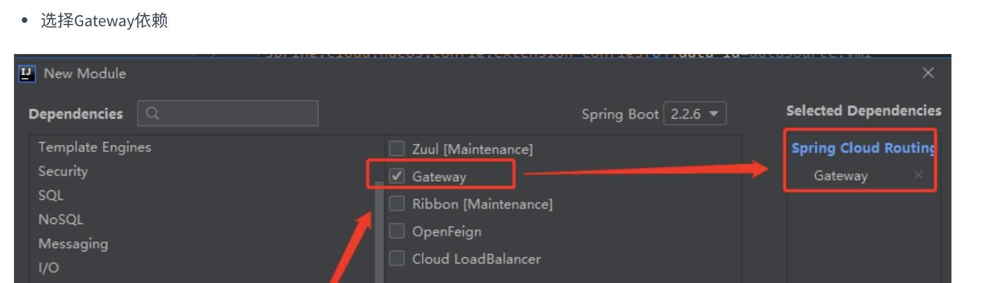
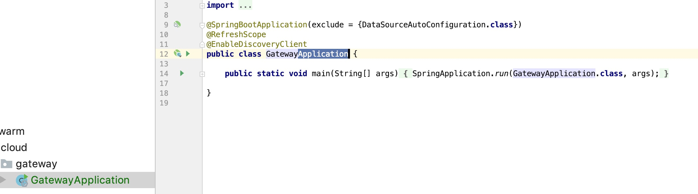
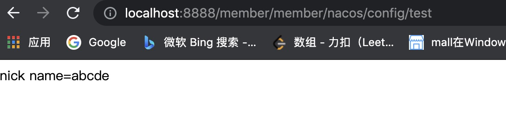

# 整合Gateway

## 创建gateway项目

- 创建

  

- 添加依赖

  

## application.yml

```yaml
spring:
  application:
    name: gateway
  cloud:
    gateway:
      routes:
        - id: route_qq
          uri: http://www.qq.com
          predicates:
            - Query=url,qq
        - id: member
          uri: lb://member
          predicates:
            - Path=/member/**
    nacos:
      discovery:
        server-addr: 127.0.0.1:8849
      config:
        server-addr: 127.0.0.1:8849
server:
  port: 8888
```

## Application



## 测试



