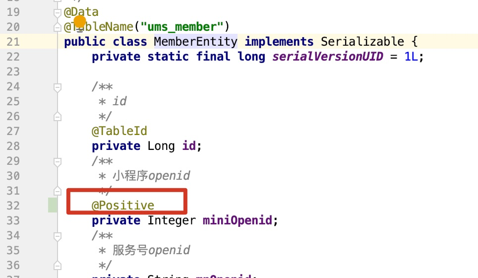
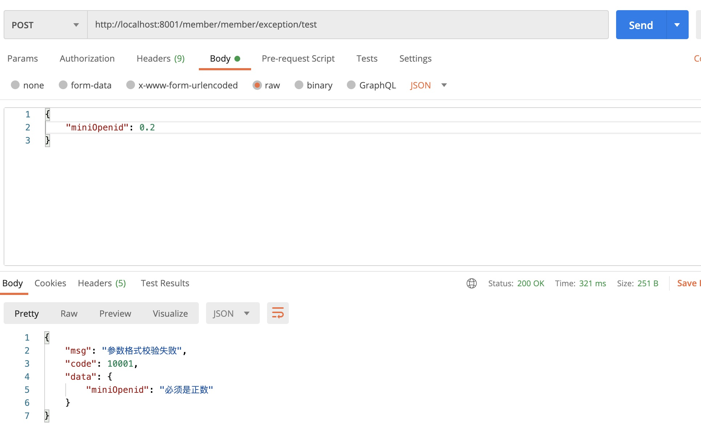

# 整合全局异常

## 公共错误码

- common模块

  ```Java
  /***
   * .错误码和错误信息定义类
   *
   * - 1.错误码长度：5个数字
   * - 2.前两位：业务场景
   * - 3.后三位：错误码
   *
   *     10：通用业务
   *     	001：参数格式校验错误（10001）
   *     11：会员业务
   *     12：题目业务
   *     13：内容业务
   *     14：学习业务
   ***/
  public enum BizCodeEnum {
      UNKNOWN_EXCEPTION(10000, "系统未知异常"),
      VALID_EXCEPTION(10001, "参数格式校验失败"),
      QUESTION_SAVE_EXCEPTION(12001, "题目保存异常");
  
      private int code;
      private String msg;
      BizCodeEnum(int code, String msg) {
          this.code = code;
          this.msg = msg;
      }
  
      public int getCode() {
          return code;
      }
  
      public String getMsg() {
          return msg;
      }
  }
  ```

## 全局异常类

- 在每个模块里

  ```Java
  package com.taiwarm.cloud.member.exception;
  
  import com.taiwarm.cloud.exception.BizCodeEnum;
  import com.taiwarm.cloud.utils.R;
  import lombok.extern.slf4j.Slf4j;
  import org.springframework.validation.BindingResult;
  import org.springframework.web.bind.MethodArgumentNotValidException;
  import org.springframework.web.bind.annotation.ExceptionHandler;
  import org.springframework.web.bind.annotation.ResponseBody;
  import org.springframework.web.bind.annotation.RestControllerAdvice;
  
  import java.util.HashMap;
  import java.util.Map;
  
  @Slf4j
  @RestControllerAdvice(basePackages = {"com.taiwarm.cloud.member.controller"})
  public class ExceptionControllerAdvice {
  
      @ResponseBody
      @ExceptionHandler(value = MethodArgumentNotValidException.class)
      public R handleValidException(MethodArgumentNotValidException e){
          log.error("数据校验出现问题{}，异常类型：{}", e.getMessage(), e.getClass());
          BindingResult bindingResult = e.getBindingResult();
          Map<String, String> errorMap = new HashMap<>();
          bindingResult.getFieldErrors().forEach((fieldError)->{
              errorMap.put(fieldError.getField(), fieldError.getDefaultMessage());
          });
  
          return R.error(BizCodeEnum.VALID_EXCEPTION.getCode(), BizCodeEnum.VALID_EXCEPTION.getMsg()).put("data", errorMap);
      }
  
      @ExceptionHandler(value=Throwable.class)
      public R handleException(Throwable throwable) {
          throwable.printStackTrace();
          log.error("未知异常{}，异常类型：{}", throwable.getMessage(), throwable.getClass());
  
          return R.error(BizCodeEnum.UNKNOWN_EXCEPTION.getCode(), BizCodeEnum.UNKNOWN_EXCEPTION.getMsg());
      }
  }
  
  ```

## 错误方法

- controller里例子

  ```java
  @RequestMapping("/exception/test")
      public R exceptionTest(@Valid @RequestBody MemberEntity memberEntity){
          System.out.println(memberEntity);
          return R.ok();
      }
  ```

- 实体类

  

## 测试



