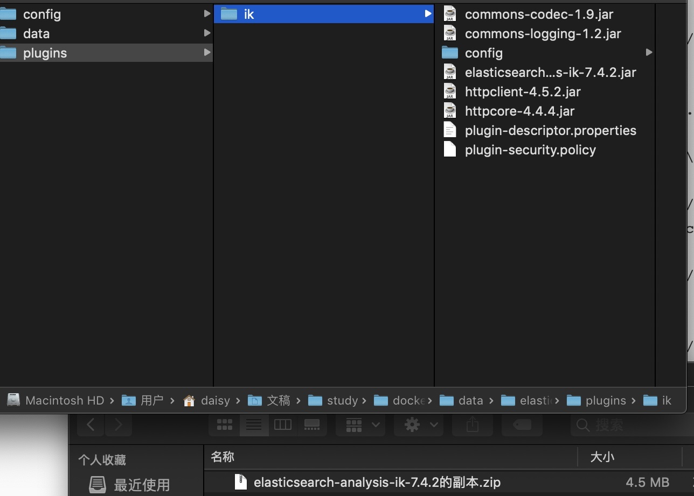
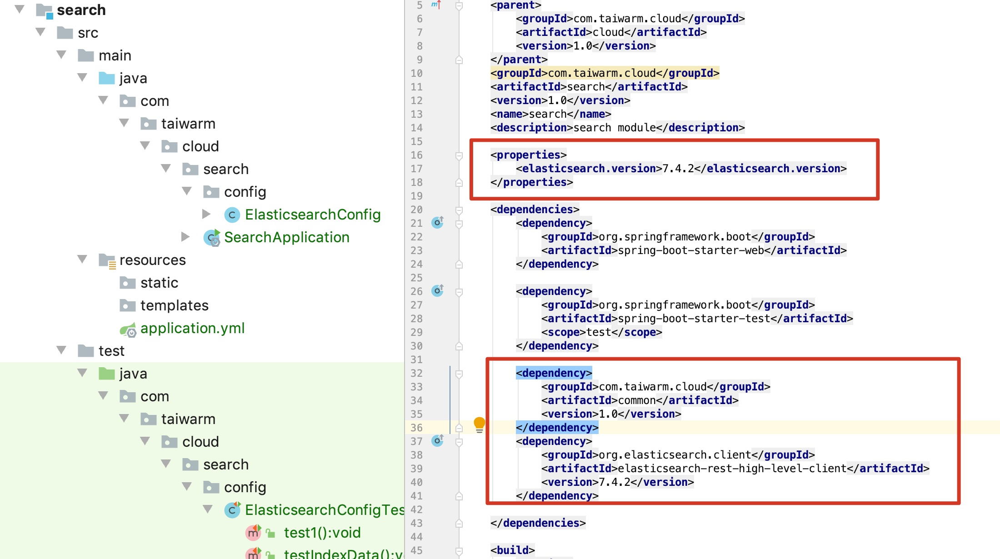
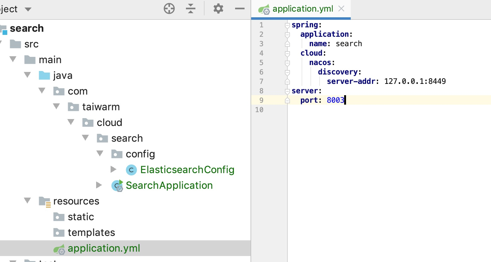
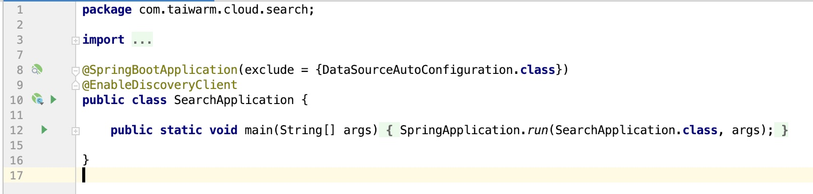

# 整合ES

## docker部署ES

```shell
docker pull elasticsearch:7.4.2

# /Users/daisy/Documents/study/docker/data下创建文件夹
mkdir -p elasticsearch/config
mkdir -p elasticsearch/data

# 赋权
chmod -R 777 elasticsearch/

echo "http.host: 0.0.0.0" >> config/elasticsearch.yml

# 启动ES
docker run --name elasticsearch-7.4.2 -p 9200:9200 -p 9300:9300 \
-e "discovery.type"="single-node" \
-e ES_JAVA_OPTS="-Xms64m -Xmx128m" \
-v /Users/daisy/Documents/study/docker/data/elasticsearch/config/elasticsearch.yml:/usr/share/elasticsearch/config/elasticsearch.yml \
-v /Users/daisy/Documents/study/docker/data/elasticsearch/data:/usr/share/elasticsearch/data \
-v /Users/daisy/Documents/study/docker/data/elasticsearch/plugins:/usr/share/elasticsearch/plugins \
-d elasticsearch:7.4.2

```

## docker部署Kibana

```
docker pull kibana:7.4.2

docker run --name kibana-7.4.2 -e ELASTICSEARCH_HOSTS=http://192.168.3.13:9200 -p 5601:5601 -d kibana:7.4.2

```

## ES安装中文分词器

```
# 下载：https://github.com/medcl/elasticsearch-analysis-ik/releases?after=v7.6.2 中7.4.2版本
# 解压到plugin文件夹下
# 重启es
# 启动完成后验证是否安装成功
# 进入容器、执行elasticsearch-plugin list
```



## spring cloud引入ES

- 创建search模块

- pom引入

  

- application

  

- Application

  

- config

  ```java
  package com.taiwarm.cloud.search.config;
  
  import org.apache.http.HttpHost;
  import org.elasticsearch.client.RestClient;
  import org.elasticsearch.client.RestHighLevelClient;
  import org.springframework.context.annotation.Bean;
  import org.springframework.context.annotation.Configuration;
  
  @Configuration
  public class ElasticsearchConfig {
      @Bean
      // 给容器注册一个 RestHighLevelClient，用来操作 ES
      // 参考官方文档：https://www.elastic.co/guide/en/elasticsearch/client/java-rest/7.9/java-rest-high-getting-started-initialization.html
      public RestHighLevelClient restHighLevelClient() {
          return new RestHighLevelClient(
                  RestClient.builder(
                          new HttpHost("127.0.0.1", 9200, "http")));
      }
  }
  
  ```

- 测试类

  ```java
  package com.taiwarm.cloud.search.config;
  
  import com.alibaba.fastjson.JSON;
  import org.elasticsearch.action.index.IndexRequest;
  import org.elasticsearch.action.index.IndexResponse;
  import org.elasticsearch.client.RequestOptions;
  import org.elasticsearch.client.RestHighLevelClient;
  import org.elasticsearch.common.xcontent.XContentType;
  import org.junit.jupiter.api.Test;
  import org.springframework.beans.factory.annotation.Autowired;
  import org.springframework.beans.factory.annotation.Qualifier;
  import org.springframework.boot.test.context.SpringBootTest;
  
  import java.io.IOException;
  
  @SpringBootTest
  class ElasticsearchConfigTest {
  
      @Qualifier("restHighLevelClient")
      @Autowired
      private RestHighLevelClient client;
  
      @Test
      public void test1(){
          System.out.println("client===="+client);
      }
  
      /**
       * 测试存储数据到 ES。
       * */
      @Test
      public void testIndexData() throws IOException {
          IndexRequest request = new IndexRequest("users");
          request.id("1"); // 文档的 id
  
          //构造 User 对象
          User user = new User();
          user.setUsername("PassJava");
          user.setAge(18);
          user.setGender("Man");
  
          //User 对象转为 JSON 数据
          String jsonString = JSON.toJSONString(user);
  
          // JSON 数据放入 request 中
          request.source(jsonString, XContentType.JSON);
  
          // 执行插入操作
          IndexResponse response = client.index(request, RequestOptions.DEFAULT);
  
          System.out.println(response);
      }
  
  }
  
  ```

  

