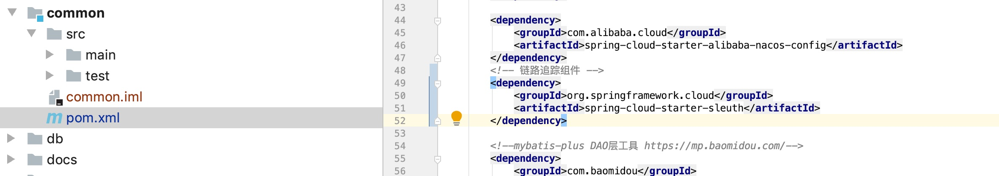
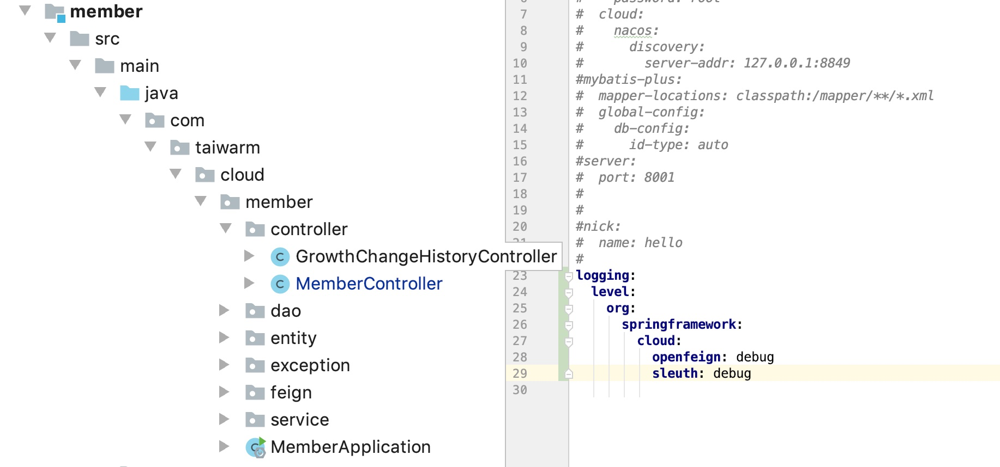
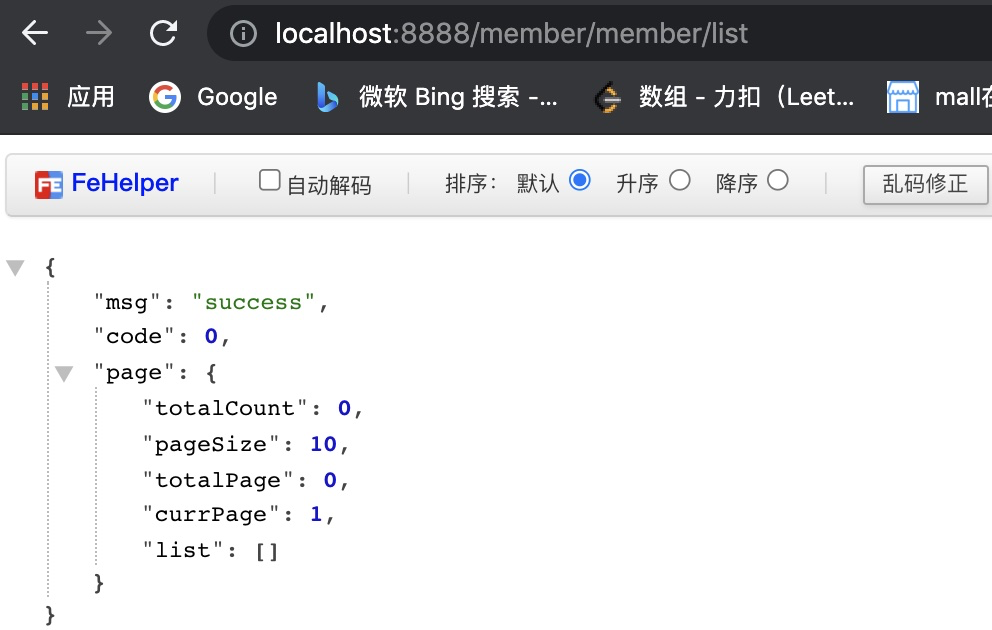
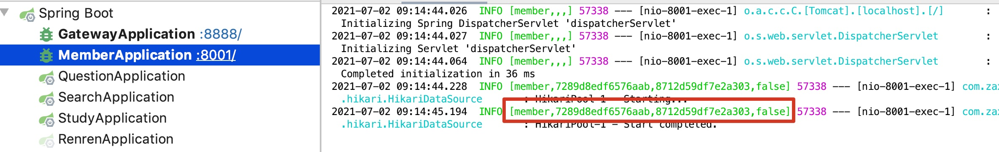

# 整合链路追踪

## spring cloud 整合sleuth

- common模块配置pom

  

- member模块配置log日志输出

  

- 测试

  



## 整合zipkin

- docker安装

  ```
  docker pull openzipkin/zipkin
  docker run -d --restart always -p 9411:9411 --name zipkin openzipkin/zipkin 
  
  
  ```

  