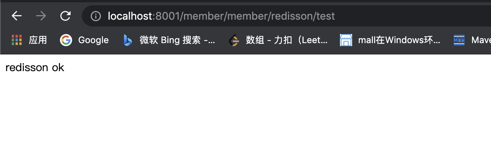
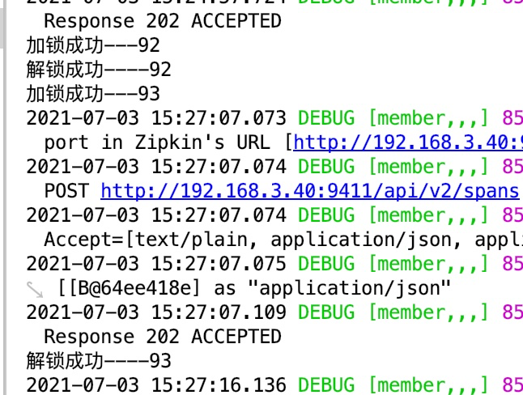

# 整合Redisson

## pom

- common模块

  ```xml
   <!-- https://mvnrepository.com/artifact/org.redisson/redisson -->
   <dependency>
   		<groupId>org.redisson</groupId>
   		<artifactId>redisson</artifactId>
   		<version>3.15.5</version>
   </dependency>
  ```

## config

- common

  ```java
  @Configuration
  public class MyRedissonConfig {
  
      @Value("${redis.ip}")
      private String redisIp;
  
      @Value("${redis.port}")
      private Integer redisPort;
  
  
      /**
       * 对 Redisson 的使用都是通过 RedissonClient 对象
       * @return
       * @throws IOException
       */
      @Bean(destroyMethod = "shutdown") // 服务停止后调用 shutdown 方法。
      public RedissonClient redisson() throws IOException {
          System.out.println("============="+redisIp+"=========="+redisPort);
          // 1.创建配置
          Config config = new Config();
          // 集群模式
          // config.useClusterServers().addNodeAddress("127.0.0.1:7004", "127.0.0.1:7001");
          // 2.根据 Config 创建出 RedissonClient 示例。
  //        config.useSingleServer().setAddress("redis://127.0.0.1:6379");
          config.useSingleServer().setAddress("redis://"+redisIp+":"+redisPort);
          return Redisson.create(config);
      }
  }
  ```

## 测试方法

- application.yml

  ```yaml
  redis:
    ip: @redis.ip@
    port: @redis.port@
  ```

- java类

  ```java
  @Autowired
  private RedissonClient redissonClient;
  
  @RequestMapping("/redisson/test")
      public String RedissonTest(){
          RLock lock = redissonClient.getLock("lock");
          lock.lock();
          try {
              System.out.println("加锁成功---" + Thread.currentThread().getId());
              Thread.sleep(9000);
          } catch (Exception e) {
              e.printStackTrace();
          } finally {
              lock.unlock();
              System.out.println("解锁成功----"+Thread.currentThread().getId());
          }
          return "redisson ok";
      }
  ```

- 启动类

  - 增加scanBasePackages，否则在common中配置文件无法加载到

  ```java
  @SpringBootApplication(scanBasePackages = "com.taiwarm.cloud")
  @MapperScan("com.taiwarm.cloud.member.dao")
  @EnableDiscoveryClient
  @EnableFeignClients(basePackages = "com.taiwarm.cloud.member.feign")
  public class MemberApplication {
  
      public static void main(String[] args) {
          SpringApplication.run(MemberApplication.class, args);
      }
  
  }
  ```

## 测试效果

- 浏览器访问



- 输出：锁等待、阻塞效果，第一个锁完成后第二个锁进行操作

  

