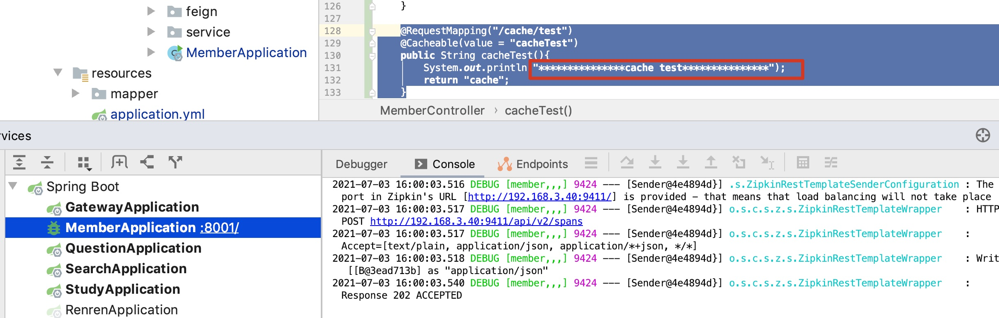

# 整合Spring Cache

## pom

- common模块

  ```xml
  <dependency>
              <groupId>org.springframework.boot</groupId>
              <artifactId>spring-boot-starter-cache</artifactId>
          </dependency>
  
          <dependency>
              <groupId>org.springframework.boot</groupId>
              <artifactId>spring-boot-starter-data-redis</artifactId>
          </dependency>
  
  ```

## application

- 子模块

  ```yaml
  spring:
    cache:
      type: redis
    redis:
      host: @redis.ip@
      port: @redis.port@
  ```

## 启动类

```java
@EnableCaching
```

## 测试方法

```java
@RequestMapping("/cache/test")
@Cacheable(value = "cacheTest")
public String cacheTest(){
    System.out.println("***************cache test***************");
    return "cache";
}
```

## 测试效果


- 输入值但是没进调用方法

  

