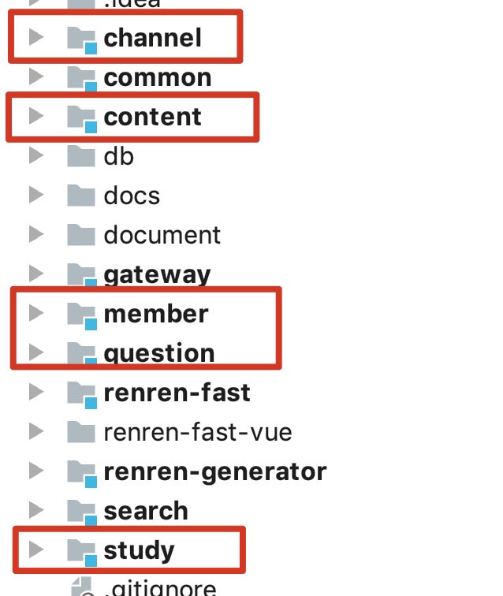
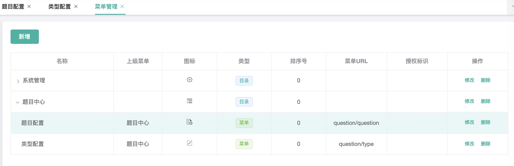
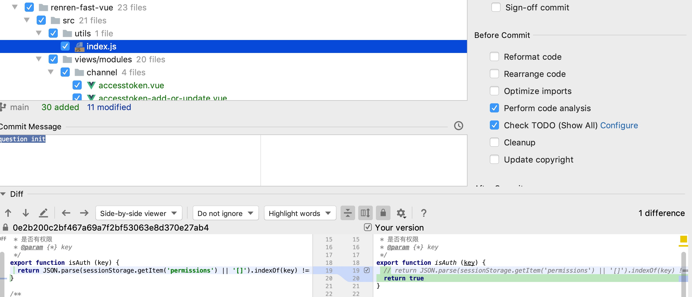
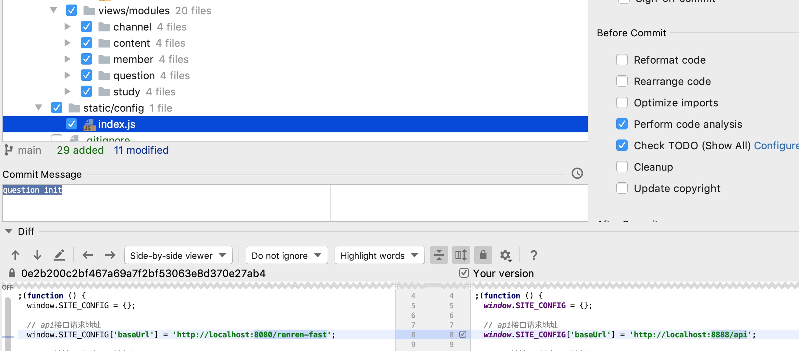

# 整合全部模块

## 全部模块代码自动生成

- 模块图

  

- 数据库图

  

- 添加菜单

  

## vue

- 新增功能开放

  

- 拷贝各模块代码、配置请求URL

  

## gateway

- 解决跨域问题

  ```java
  package com.taiwarm.cloud.gateway.config;
  
  import org.springframework.context.annotation.Bean;
  import org.springframework.context.annotation.Configuration;
  import org.springframework.web.cors.CorsConfiguration;
  import org.springframework.web.cors.reactive.CorsWebFilter;
  import org.springframework.web.cors.reactive.UrlBasedCorsConfigurationSource;
  
  @Configuration
  public class MyCorsConfiguration {
      @Bean
      public CorsWebFilter corsWebFilter() {
          UrlBasedCorsConfigurationSource source = new UrlBasedCorsConfigurationSource();
  
          CorsConfiguration corsConfiguration = new CorsConfiguration();
  
          // 配置跨域
          corsConfiguration.addAllowedHeader("*"); // 允许所有请求头跨域
          corsConfiguration.addAllowedMethod("*"); // 允许所有请求方法跨域
          corsConfiguration.addAllowedOrigin("*"); // 允许所有请求来源跨域
          corsConfiguration.setAllowCredentials(true); //允许携带cookie跨域，否则跨域请求会丢失cookie信息
  
          source.registerCorsConfiguration("/**", corsConfiguration);
  
          return new CorsWebFilter(source);
      }
  }
  ```

- URL分发

  ```xml
  - id: question
    uri: lb://question
    predicates:
      - Path=/api/question/**
    filters: #过滤器
      - RewritePath=/api/(?<segment>.*),/$\{segment}
  - id: renren-fast
    uri: lb://renren-fast
    predicates:
      - Path=/api/**
    filters: #过滤器
      - RewritePath=/api/(?<segment>.*),/renren-fast/$\{segment}
  ```

## renren-fast

- 注销跨域、加入总pom、加入nacos

